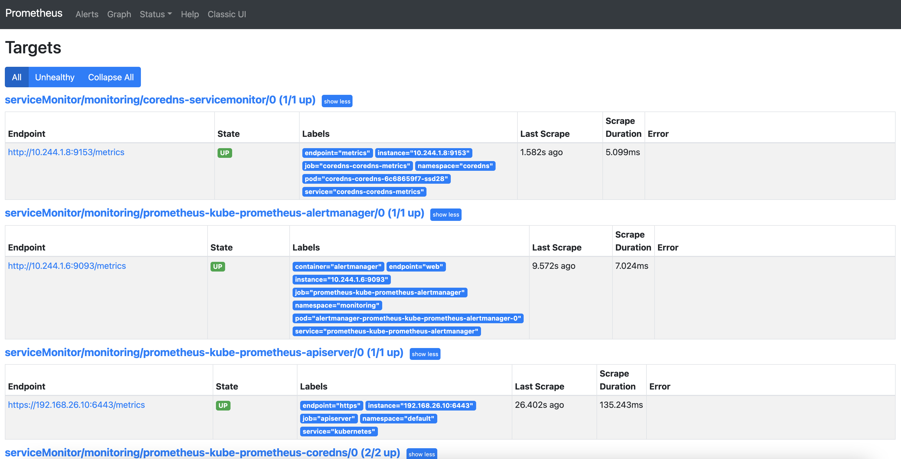
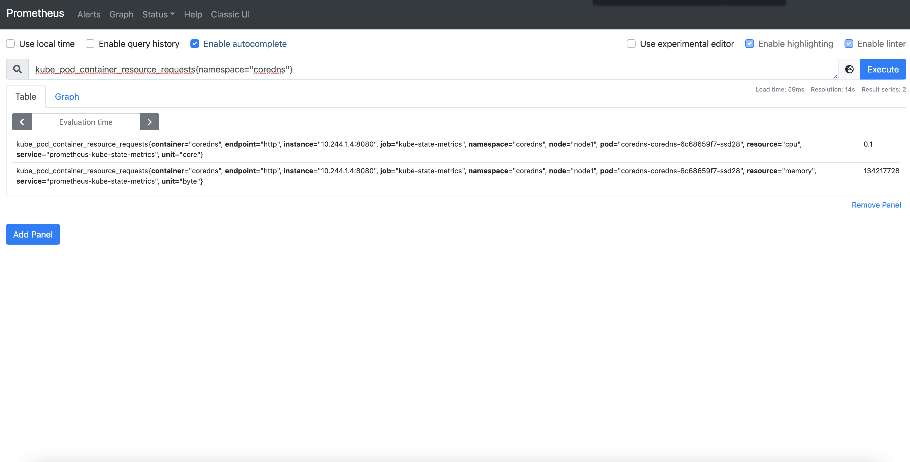

# Monitoring

## Prerequisites

Before using **kubectl**, please set the **KUBECONFIG** environment variable to point to the right kubeconfig file.

```console
$ export KUBECONFIG=../02-Multi-node_cluster/vagrant/kubeconfig.yaml
```

Other than `kubectl`, you need `helm` installed on your computer in order to deploy the Prometheus stack, download here: https://helm.sh/docs/intro/install/


## The Prometheus stack

**kube-prometheus-stack** is a collection of Kubernetes manifests including the following:

- Prometheus operator
- Prometheus
- Alertmanager
- Prometheus node-exporter
- Prometheus Adapter
- kube-state-metrics
- Grafana

pre-configured to collect metrics from all Kubernetes component
delivers a default set of dashboards and alerting rules.


Just before to install **kube-prometheus-stack**, create a dedicated namespace:

```console
$ kubectl create ns monitoring
namespace/monitoring created
```

Now add the **kube-prometheus-stack** Helm repo

```console
$ helm repo add prometheus-community https://prometheus-community.github.io/helm-charts
"prometheus-community" has been added to your repositories
```

Update the Helm repositories index

```console
$ helm repo update
Hang tight while we grab the latest from your chart repositories..
...Successfully got an update from the "prometheus-community" chart repository
Update Complete. ⎈Happy Helming!⎈
``` 

Finally, install **kube-prometheus-stack** 

```console
$ helm install prometheus prometheus-community/kube-prometheus-stack -n monitoring
NAME: prometheus
LAST DEPLOYED: Wed May  5 13:29:17 2021
NAMESPACE: monitoring
STATUS: deployed
REVISION: 1
NOTES:
kube-prometheus-stack has been installed. Check its status by running:
  kubectl --namespace monitoring get pods -l "release=prometheus"

Visit https://github.com/prometheus-operator/kube-prometheus for instructions on how to create & configure Alertmanager and Prometheus instances using the Operator.
```

You should see a lot of pods in the newly created **moniitoring** namespace

```console
$ kubectl get pods -n monitoring
NAME                                                     READY   STATUS    RESTARTS   AGE
alertmanager-prometheus-kube-prometheus-alertmanager-0   2/2     Running   0          34s
prometheus-grafana-55766c6774-6szvl                      2/2     Running   0          47s
prometheus-kube-prometheus-operator-57dd45c455-57f9b     1/1     Running   0          46s
prometheus-kube-state-metrics-577cdff758-xlngj           1/1     Running   0          46s
prometheus-prometheus-kube-prometheus-prometheus-0       2/2     Running   1          34s
prometheus-prometheus-node-exporter-bldmn                1/1     Running   0          47s
prometheus-prometheus-node-exporter-c5lkc                1/1     Running   0          47s
prometheus-prometheus-node-exporter-k5959                1/1     Running   0          47s
```

Try connecting to Grafana to see the build-in dashboards. To do so, open a port-forward point to the Grafana service

```console
$ kubectl port-forward svc/prometheus-grafana --address 0.0.0.0 -n monitoring 3000:80
Forwarding from 0.0.0.0:3000 -> 80
```

Now, pointing your browser to your computer on port 3000 you should access to Grafana (in most cases http://localhost:3000).

- Username: admin
- Password: prom-operator


In the same way (thanks to a port forward) you can visit the prometheus GUI pointing your browser to your computer on port 9090 (in most cases http://localhost:9090).

```console
$ kubectl port-forward svc/prometheus-kube-prometheus-prometheus --address 0.0.0.0 -n monitoring 9090:9090
Forwarding from 0.0.0.0:9090 -> 9090
```


And Alert Manager as well

```console
$ kubectl port-forward svc/prometheus-kube-prometheus-alertmanager --address 0.0.0.0 -n monitoring 9093:9093
Forwarding from 0.0.0.0:9090 -> 9090
```

Now, point your browser to your computer on port 9093,  you should access to Alert Manager GUI (in most cases http://localhost:9093).


## Prometheus Operator endpoint to scrape autoconfiguration

Next step is to build upon this configuration to start monitoring any other services deployed in your cluster.

There are two custom resources involved in this process:

- The Prometheus CRD
  - Defines Prometheus server pod metadata
  - Defines # of Prometheus server replicas
  - Defines Alertmanager(s) endpoint to send triggered alert rules
  - Defines labels and namespace filters for the 
    - ServiceMonitor CRDs that will be applied by this Prometheus server deployment

- The ServiceMonitor objects will provide the dynamic target endpoint configuration
  - The ServiceMonitor CRD
  - Filters endpoints by namespace, labels, etc
  - Defines the different scraping ports
  - Defines all the additional scraping parameters like scraping interval, protocol to use, TLS credentials, re-labeling policies, etc.

The Prometheus object filters and selects N ServiceMonitor objects, which in turn, filter and select N Prometheus metrics endpoints.

If there is a new metrics endpoint that matches the ServiceMonitor criteria, this target will be automatically added to all the Prometheus servers that select that ServiceMonitor.


As you can see in the diagram above, the ServiceMonitor targets Kubernetes services, not the endpoints directly exposed by the pod(s).

We already have a Prometheus deployment monitoring all the Kubernetes internal metrics (kube-state-metrics, node-exporter, Kubernetes API, etc) and we want to use the same to monitor also our applications.

We need a service to scrape: CoreDNS is a fast and flexible DNS server that exposes Prometheus metrics out of the box (using port 9153), we will use it for testing ServiceMonitors.

```console
$ helm repo add coredns https://coredns.github.io/helm
"coredns" has been added to your repositories
```

```console
$ helm repo update
Hang tight while we grab the latest from your chart repositories...
...Successfully got an update from the "coredns" chart repository
...Successfully got an update from the "prometheus-community" chart repository
Update Complete. ⎈Happy Helming!⎈
```

```console
$ helm install coredns --namespace=coredns coredns/coredns --create-namespace --set prometheus.service.enabled=true
NAME: coredns
LAST DEPLOYED: Wed May  5 22:30:56 2021
NAMESPACE: coredns
STATUS: deployed
REVISION: 1
TEST SUITE: None
NOTES:
CoreDNS is now running in the cluster as a cluster-service.

It can be tested with the following:

1. Launch a Pod with DNS tools:

kubectl run -it --rm --restart=Never --image=infoblox/dnstools:latest dnstools

2. Query the DNS server:

/ # host kubernetes
```

CoreDNS expose its metrics at port 9153

```
$ kubectl get svc -n coredns
NAME                      TYPE        CLUSTER-IP       EXTERNAL-IP   PORT(S)         AGE
coredns-coredns           ClusterIP   10.108.222.137   <none>        53/UDP,53/TCP   3s
coredns-coredns-metrics   ClusterIP   10.105.181.229   <none>        9153/TCP        3s
```

Let's apply the [ServiceMonitor](coredns-servicemonitor.yaml)

```
$ kubectl apply -f coredns-servicemonitor.yaml 
servicemonitor.monitoring.coreos.com/coredns-servicemonitor created
```

If you go back to our Prometheus instance GUI after a few minutes lates (using port-forward on port 9090->9090), you should see a new target being monitored (our CoreDNS instance)



And metrics should have popped out as well



## Prometheus Operator – How to configure Alert Rules

In the existing Prometheus deployment there is a configuration block to filter and match these objects:

```yaml
ruleSelector:
      matchLabels:
        app: kube-prometheus-stack
        release: prometheus
```

If you define an object containing the PromQL rules you desire and matching the desired metadata, they will be automatically added to the Prometheus servers’ configuration.

This object is described in [dead-man-switch-rule.yaml](dead-man-switch-rule.yaml), let's apply it.

```
$ kubectl apply -f dead-man-switch-rule.yaml
servicemonitor.monitoring.coreos.com/coredns-servicemonitor created
```

As soon as you apply the rule file, a new rule is being discovered by Prometheus


And since this was an always-firing rule, after a couple of minutes we should see also an alert being triggered:

