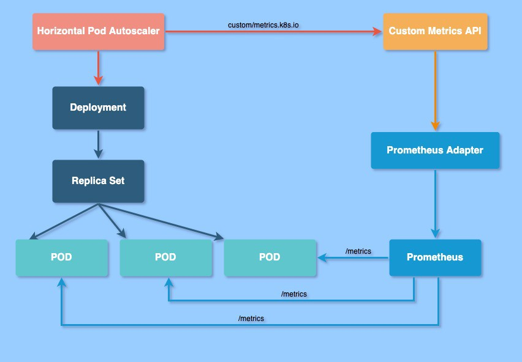
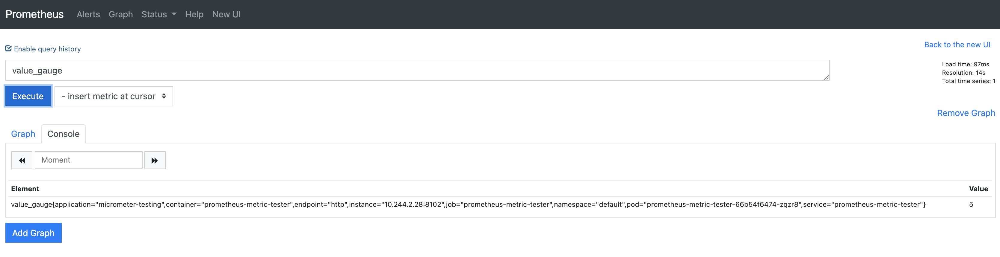

# Horizontal pod autoscaler

## Prerequisites

Before using **kubectl**, please set the **KUBECONFIG** environment variable to point to the right kubeconfig file.

```console
$ export KUBECONFIG=../02-Multi-node_cluster/vagrant/kubeconfig.yaml
```

Other than `kubectl`, you need `helm` installed on your computer in order to deploy the Prometheus Adapter, download here: https://helm.sh/docs/intro/install/

To run the second part of this lab you must have deployed the monitoring framework as described in lab [24-Monitoring](../24-Monitoring/README.md)

## The HPA

The Horizontal Pod Autoscaler (HPA) automatically scales the number of Pods in a replication controller, deployment, replica set or stateful set based on observed CPU utilization and memory consumption (or, with custom metrics support, on some other application-provided metrics).

The Horizontal Pod Autoscaler is implemented as a Kubernetes API resource and a controller. The resource determines the behavior of the controller. The controller periodically adjusts the number of replicas in a replication controller or deployment to match the observed metrics such as average CPU utilisation, average memory utilisation or any other custom metric to the target specified by the user.


Horizontal Pod Autoscaling does not apply to objects that can't be scaled, for example, DaemonSets.

From the most basic perspective, the Horizontal Pod Autoscaler controller operates on the ratio between desired metric value and current metric value:

```
desiredReplicas = ceil[currentReplicas * ( currentMetricValue / desiredMetricValue )]
```

For example, if the current metric value is 200m, and the desired value is 100m, the number of replicas will be doubled, since 200.0 / 100.0 == 2.0 If the current value is instead 50m, we'll halve the number of replicas, since 50.0 / 100.0 == 0.5.


## HPA in action

To demonstrate Horizontal Pod Autoscaler we will use a custom docker image based on the php-apache image. The Dockerfile has the following content:

```Dockerfile
FROM php:5-apache
COPY index.php /var/www/html/index.php
RUN chmod a+rx index.php
```

It defines an index.php page which performs some CPU intensive computations:

```php
<?php
  $x = 0.0001;
  for ($i = 0; $i <= 1000000; $i++) {
    $x += sqrt($x);
  }
  echo "OK!";
?>
````

First, we will start a [deployment](application.yaml) running the image and expose it as a service using the following configuration:

```yaml
...
resources:
    limits:
        cpu: 500m
    requests:
        cpu: 200m
...
```

Run the following command:

```console
$ kubectl apply -f application.yaml
deployment.apps/php-apache created
service/php-apache created
```

Now that the server is running, we will create the autoscaler (see [hpa.yaml](hpa.yaml))

The following command will create a Horizontal Pod Autoscaler that maintains between 1 and 10 replicas of the Pods controlled by the php-apache deployment we created in the first step of these instructions. Roughly speaking, HPA will increase and decrease the number of replicas (via the deployment) to maintain an average CPU utilization across all Pods of 50% (since each pod requests 200 milli-cores by kubectl run), this means average CPU usage of 100 milli-cores). See here for more details on the algorithm.

```console
$ kubectl apply -f hpa.yaml
horizontalpodautoscaler.autoscaling/test-hpa created
```

We may check the current status of autoscaler by running:

```console
$ kubectl get hpa
NAME       REFERENCE               TARGETS   MINPODS   MAXPODS   REPLICAS   AGE
test-hpa   Deployment/php-apache   0%/50%    1         10        1          7m11s
```

Please note that the current CPU consumption is 0% as we are not sending any requests to the server (the TARGET column shows the average across all the pods controlled by the corresponding deployment).

Now, we will see how the autoscaler reacts to increased load. We will start a container, and send an infinite loop of queries to the php-apache service (please run it in a different terminal):

```console
$ kubectl run -i --tty load-generator --rm --image=busybox --restart=Never -- /bin/sh -c "while sleep 0.01; do wget -q -O- http://php-apache; done"
K!OK!OK!OK!OK!OK!OK!OK!OK!OK!OK!OK!OK!OK!OK!OK!OK!OK!OK!OK!OK!OK!OK!OK!OK!OK!OK!OK!OK!OK!OK!OK!OK!OK!OK!OK!OK!OK!OK!OK!OK!OK!OK!OK!OK!OK!OK!OK!OK!OK!OK!OK!OK!OK!OK!OK!OK!OK!OK!OK!OK!OK!OK!OK!OK!OK!OK!OK!OK!OK!OK!OK!OK!OK!OK!OK!OK!OK!OK!OK!OK!OK!OK!OK!OK!OK!OK!OK!OK!OK!OK!OK!OK!OK!OK!OK!OK!OK!OK!OK!OK!OK!OK!OK!OK!OK!OK!OK!OK!OK!OK!OK!OK!OK!OK!OK!OK!OK!OK!OK!OK!OK!OK!OK!OK!OK!OK!OK!OK!OK!OK!OK!OK!OK!OK!OK!OK!OK!OK!OK!OK!OK!OK!OK!OK!OK!OK!OK!OK!OK!OK!OK!OK!OK!OK!OK!OK!OK!OK!OK!OK!OK!OK!OK!OK!OK!OK!OK!OK!OK!OK!OK!OK!OK!OK!OK!OK!OK!OK!OK!OK!OK!OK!OK!OK!OK!OK!OK!OK!OK!OK!OK!OK!OK!OK!OK!OK!OK!OK!OK!OK!OK!OK!OK!OK!OK!OK!OK!OK!OK!OK!OK!OK!OK!OK!OK!OK!OK!OK!OK!OK!OK!OK!OK!OK!OK!OK!OK!OK!OK!OK!OK!OK!OK!OK!OK!OK!OK!OK!OK!OK!OK!OK!OK!OK!OK!OK!OK!OK!OK!OK!
...
```

Within a minute or so, we should see the higher CPU load by executing:

```console
$ kubectl get hpa
NAME       REFERENCE               TARGETS    MINPODS   MAXPODS   REPLICAS   AGE
test-hpa   Deployment/php-apache   250%/50%   1         10        5          10m
```

Here, CPU consumption has increased to 250% of the request. As a result, the deployment was resized to 5 replicas:

```console
$ kubectl get deployment php-apache
NAME         READY   UP-TO-DATE   AVAILABLE   AGE
php-apache   5/5     5            5           14m
```

```console
$ kubectl get pods | egrep "NAME|php-apache"
NAME                          READY   STATUS    RESTARTS   AGE
php-apache-79544c9bd9-5rk5p   1/1     Running   0          14m
php-apache-79544c9bd9-9w797   1/1     Running   0          119s
php-apache-79544c9bd9-bp7gg   1/1     Running   0          104s
php-apache-79544c9bd9-dsxt9   1/1     Running   0          119s
php-apache-79544c9bd9-fcds2   1/1     Running   0          119s
```

We will finish our example by stopping the user load (type CTRL+C on the terminal we you run the curl loop).

Then we will verify the result state (after a minute or so):

```console
$ kubectl get hpa
NAME         REFERENCE                     TARGET       MINPODS   MAXPODS   REPLICAS   AGE
php-apache   Deployment/php-apache/scale   0% / 50%     1         10        1          17m
```

then

```
$ kubectl get deployment php-apache
NAME         READY   UP-TO-DATE   AVAILABLE   AGE
php-apache   1/1     1            1           27m
```

Here CPU utilization dropped to 0, and so HPA autoscaled the number of replicas back down to 1 (autoscaling the replicas may take a few minutes).

## Use HPA with custom metrics (Prometheus)

NB: Prometheus stack is required in order to perform this lab. Please refer to lab [24-Monitoring](../24-Monitoring/README.md).

Custom Metrics API make it possible for monitoring systems like Prometheus to expose application-specific metrics to the HPA controller.

In order to scale based on custom metrics we need to have two components:

- One that collects metrics from our applications and stores them to Prometheus time series database.

- The second one that extends the Kubernetes Custom Metrics API with the metrics supplied by a collector, the k8s-prometheus-adapter. This is an implementation of the custom metrics API that attempts to support arbitrary metrics.



First of all, let's deploy a testing application that exposes Prometheus metrics:

```console
$ kubectl apply -f test_app.yaml
deployment.apps/prometheus-metric-tester created
service/prometheus-metric-tester-service created
```

This application is made for testing Prometheus metrics; it exposes a special metric named `value_gauge` whose value can bhe set using a REST API.

To test scraping the metric's initial value:

```
$ kubectl run -i --rm --tty client --image=curlimages/curl --restart=Never -- \
  curl \
  -s \
  http://prometheus-metric-tester-service:8102/metric-test/actuator/prometheus/ | egrep ^value_gauge
value_gauge{application="micrometer-testing",} 0.0
```

To set a custom value:

```
$ kubectl run -i --rm --tty client --image=curlimages/curl --restart=Never -- \
    curl \
    -s \
    -X POST \
    -H "Content-Type: application/json" \
    --data '{"value":"5"}' \
    prometheus-metric-tester-service:8102/metric-test/api/v2/updateValue
pod "client" deleted
```

To verify the new value exposed by the metric:

```
$ kubectl run -i --rm --tty client --image=curlimages/curl --restart=Never -- \
  curl \
  -s \
  http://prometheus-metric-tester-service:8102/metric-test/actuator/prometheus/ | egrep ^value_gauge
value_gauge{application="micrometer-testing",} 5.0
```

In order to let Prometheus scrape our test application's metrics, let's apply its [service monitor](test_app-servicemonitor.yaml) as well:

```console
$ kubectl apply -f test_app-servicemonitor.yaml
servicemonitor.monitoring.coreos.com/prometheus-metric-tester-servicemonitor created
```

Open a port-forward to see if Prometheus discovered the new target a started scraping metrics from it:

```
$ kubectl port-forward svc/prometheus-kube-prometheus-prometheus --address 0.0.0.0 -n monitoring 9090:9090
```

Now verify that Prometheus started scraping the new target and the new value (5.0) is acually seen using the GUI



To be able to use this metric to scale the application, the Prometheus adapter must be installed:

```
$ helm repo add prometheus-community https://prometheus-community.github.io/helm-charts
"prometheus-community" has been added to your repositories
```

Update Helm repo index

```
$ helm repo update
Hang tight while we grab the latest from your chart repositories...
...Successfully got an update from the "prometheus-community" chart repository
Update Complete. ⎈Happy Helming!⎈
```

Install the adapter

```
$ helm install prometheus-adapter prometheus-community/prometheus-adapter --values prometheus-adapter-values.yaml -n monitoring
NAME: prometheus-adapter
LAST DEPLOYED: Sun May  9 00:18:01 2021
NAMESPACE: default
STATUS: deployed
REVISION: 1
TEST SUITE: None
NOTES:
prometheus-adapter has been deployed.
In a few minutes you should be able to list metrics using the following command(s):

  kubectl get --raw /apis/custom.metrics.k8s.io/v1beta1
```

After a couple of minutes, you can check if the adapter is running by executing:

```console
$ kubectl get --raw /apis/custom.metrics.k8s.io/v1beta1
...
```

You should see a long JSON flowing on the screen after this command.

Apply the Prometheus Adapter config map

```console
$ kubectl apply -f prometheus-adapter-cm.yaml
configmap/prometheus-adapter configured
```

At this point restart the Prometheus Adapter

```console
$ kubectl scale --replicas=0 deploy prometheus-adapter -n monitoring && kubectl scale --replicas=1 deploy prometheus-adapter -n monitoring 
deployment.apps/prometheus-adapter scaled
deployment.apps/prometheus-adapter scaled
```

After a few minutes, you should get your metric from the adapter

```console
$ kubectl get --raw "/apis/custom.metrics.k8s.io/v1beta1/namespaces/default/pods/*/value_gauge" | jq .
{
  "kind": "MetricValueList",
  "apiVersion": "custom.metrics.k8s.io/v1beta1",
  "metadata": {
    "selfLink": "/apis/custom.metrics.k8s.io/v1beta1/namespaces/default/pods/%2A/value_gauge"
  },
  "items": [
    {
      "describedObject": {
        "kind": "Pod",
        "namespace": "default",
        "name": "prometheus-metric-tester-5cd8bcbcfb-xv7mf",
        "apiVersion": "/v1"
      },
      "metricName": "value_gauge",
      "timestamp": "2021-05-09T01:23:22Z",
      "value": "5",
      "selector": null
    }
  ]
}
```


And now let's apply the HPA with our custom metrics

```console
$ kubectl apply -f hpa_custom_metrics.yaml
horizontalpodautoscaler.autoscaling/hpa-custom-metrics created
```

To see if it's working, take a look of the HPA

```console
$ kubectl describe hpa hpa-custom-metrics
```


## Clean up

Don't forget to clean up after you

```console
$ kubectl delete -f .
deployment.apps "php-apache" deleted
service "php-apache" deleted
horizontalpodautoscaler.autoscaling "test-hpa" deleted
```

If you want to clean-up also the monitoring framework installed during lab [24-Monitoring](../24-Monitoring/README.md):

```console
$ helm uninstall prometheus -n monitoring
```