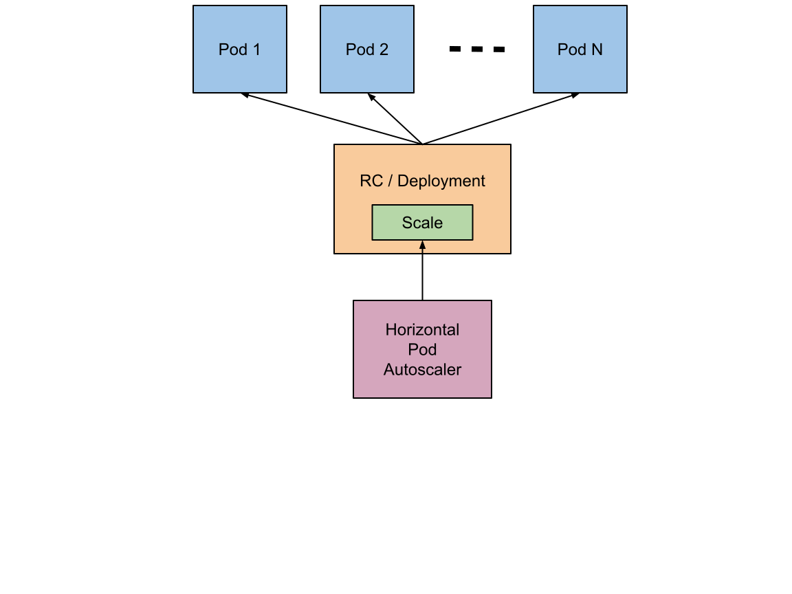

# Horizontal pod autoscaler

The Horizontal Pod Autoscaler automatically scales the number of Pods in a replication controller, deployment, replica set or stateful set based on observed CPU utilization and memory consumption (or, with custom metrics support, on some other application-provided metrics).

The Horizontal Pod Autoscaler is implemented as a Kubernetes API resource and a controller. The resource determines the behavior of the controller. The controller periodically adjusts the number of replicas in a replication controller or deployment to match the observed metrics such as average CPU utilisation, average memory utilisation or any other custom metric to the target specified by the user.



Horizontal Pod Autoscaling does not apply to objects that can't be scaled, for example, DaemonSets.

From the most basic perspective, the Horizontal Pod Autoscaler controller operates on the ratio between desired metric value and current metric value:

```
desiredReplicas = ceil[currentReplicas * ( currentMetricValue / desiredMetricValue )]
```

For example, if the current metric value is 200m, and the desired value is 100m, the number of replicas will be doubled, since 200.0 / 100.0 == 2.0 If the current value is instead 50m, we'll halve the number of replicas, since 50.0 / 100.0 == 0.5.


## HPA in action

To demonstrate Horizontal Pod Autoscaler we will use a custom docker image based on the php-apache image. The Dockerfile has the following content:

```Dockerfile
FROM php:5-apache
COPY index.php /var/www/html/index.php
RUN chmod a+rx index.php
```

It defines an index.php page which performs some CPU intensive computations:

```php
<?php
  $x = 0.0001;
  for ($i = 0; $i <= 1000000; $i++) {
    $x += sqrt($x);
  }
  echo "OK!";
?>
````

First, we will start a [deployment](application.yaml) running the image and expose it as a service using the following configuration:

```yaml
...
resources:
    limits:
        cpu: 500m
    requests:
        cpu: 200m
...
```

Run the following command:

```console
$ kubectl apply -f application.yaml
deployment.apps/php-apache created
service/php-apache created
```

Now that the server is running, we will create the autoscaler (see [hpa.yaml](hpa.yaml))

The following command will create a Horizontal Pod Autoscaler that maintains between 1 and 10 replicas of the Pods controlled by the php-apache deployment we created in the first step of these instructions. Roughly speaking, HPA will increase and decrease the number of replicas (via the deployment) to maintain an average CPU utilization across all Pods of 50% (since each pod requests 200 milli-cores by kubectl run), this means average CPU usage of 100 milli-cores). See here for more details on the algorithm.

```console
$ kubectl apply -f hpa.yaml
horizontalpodautoscaler.autoscaling/test-hpa created
```

We may check the current status of autoscaler by running:

```console
$ kubectl get hpa
NAME       REFERENCE               TARGETS   MINPODS   MAXPODS   REPLICAS   AGE
test-hpa   Deployment/php-apache   0%/50%    1         10        1          7m11s
```

Please note that the current CPU consumption is 0% as we are not sending any requests to the server (the TARGET column shows the average across all the pods controlled by the corresponding deployment).

Now, we will see how the autoscaler reacts to increased load. We will start a container, and send an infinite loop of queries to the php-apache service (please run it in a different terminal):

```console
$ kubectl run -i --tty load-generator --rm --image=busybox --restart=Never -- /bin/sh -c "while sleep 0.01; do wget -q -O- http://php-apache; done"
K!OK!OK!OK!OK!OK!OK!OK!OK!OK!OK!OK!OK!OK!OK!OK!OK!OK!OK!OK!OK!OK!OK!OK!OK!OK!OK!OK!OK!OK!OK!OK!OK!OK!OK!OK!OK!OK!OK!OK!OK!OK!OK!OK!OK!OK!OK!OK!OK!OK!OK!OK!OK!OK!OK!OK!OK!OK!OK!OK!OK!OK!OK!OK!OK!OK!OK!OK!OK!OK!OK!OK!OK!OK!OK!OK!OK!OK!OK!OK!OK!OK!OK!OK!OK!OK!OK!OK!OK!OK!OK!OK!OK!OK!OK!OK!OK!OK!OK!OK!OK!OK!OK!OK!OK!OK!OK!OK!OK!OK!OK!OK!OK!OK!OK!OK!OK!OK!OK!OK!OK!OK!OK!OK!OK!OK!OK!OK!OK!OK!OK!OK!OK!OK!OK!OK!OK!OK!OK!OK!OK!OK!OK!OK!OK!OK!OK!OK!OK!OK!OK!OK!OK!OK!OK!OK!OK!OK!OK!OK!OK!OK!OK!OK!OK!OK!OK!OK!OK!OK!OK!OK!OK!OK!OK!OK!OK!OK!OK!OK!OK!OK!OK!OK!OK!OK!OK!OK!OK!OK!OK!OK!OK!OK!OK!OK!OK!OK!OK!OK!OK!OK!OK!OK!OK!OK!OK!OK!OK!OK!OK!OK!OK!OK!OK!OK!OK!OK!OK!OK!OK!OK!OK!OK!OK!OK!OK!OK!OK!OK!OK!OK!OK!OK!OK!OK!OK!OK!OK!OK!OK!OK!OK!OK!OK!OK!OK!OK!OK!OK!OK!
...
```

Within a minute or so, we should see the higher CPU load by executing:

```console
$ kubectl get hpa
NAME       REFERENCE               TARGETS    MINPODS   MAXPODS   REPLICAS   AGE
test-hpa   Deployment/php-apache   250%/50%   1         10        5          10m
```

Here, CPU consumption has increased to 250% of the request. As a result, the deployment was resized to 5 replicas:

```console
$ kubectl get deployment php-apache
NAME         READY   UP-TO-DATE   AVAILABLE   AGE
php-apache   5/5     5            5           14m
```

```console
$ kubectl get pods | egrep "NAME|php-apache"
NAME                          READY   STATUS    RESTARTS   AGE
php-apache-79544c9bd9-5rk5p   1/1     Running   0          14m
php-apache-79544c9bd9-9w797   1/1     Running   0          119s
php-apache-79544c9bd9-bp7gg   1/1     Running   0          104s
php-apache-79544c9bd9-dsxt9   1/1     Running   0          119s
php-apache-79544c9bd9-fcds2   1/1     Running   0          119s
```

We will finish our example by stopping the user load (type CTRL+C on the terminal we you run the curl loop).

Then we will verify the result state (after a minute or so):

```console
$ kubectl get hpa
NAME         REFERENCE                     TARGET       MINPODS   MAXPODS   REPLICAS   AGE
php-apache   Deployment/php-apache/scale   0% / 50%     1         10        1          17m
```

then

```
$ kubectl get deployment php-apache
NAME         READY   UP-TO-DATE   AVAILABLE   AGE
php-apache   1/1     1            1           27m
```

Here CPU utilization dropped to 0, and so HPA autoscaled the number of replicas back down to 1 (autoscaling the replicas may take a few minutes).

## Clean up

Don't forget to clean up after you

```console
$ kubectl delete -f .
```
