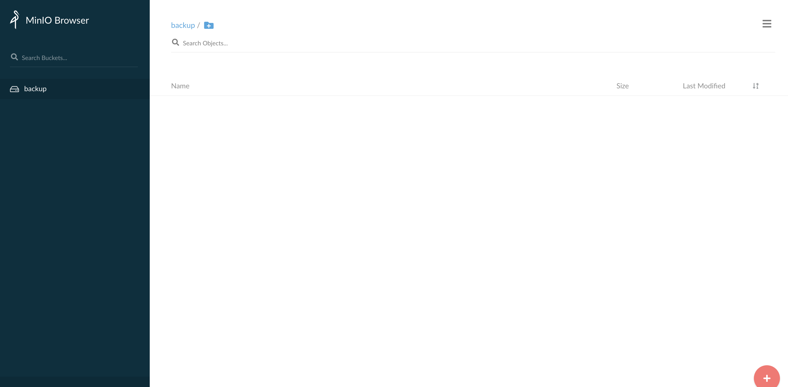
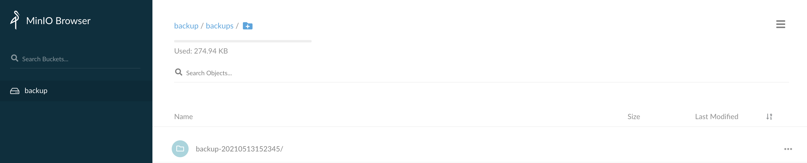

# Backup

## Prerequisites

### Setup tools

Before using **kubectl**, please set the **KUBECONFIG** environment variable to point to the right kubeconfig file.

```console
$ export KUBECONFIG=../02-Multi-node_cluster/vagrant/kubeconfig.yaml
```

Other than `kubectl`, you need `helm` installed on your computer, download here: https://helm.sh/docs/intro/install/

You need to install the `velero` CLI as well, download here: https://velero.io/docs/v1.6/basic-install.

### Install a StorageClass (lab 12)

Just apply all the manifest provided in [Lab 12](../12-StorageClass)

```console
$ kubectl apply -f ../12-StorageClass/.
service/nfs-provisioner created
serviceaccount/nfs-provisioner created
storageclass.storage.k8s.io/nfs-dynamic created
persistentvolumeclaim/nfs created
clusterrole.rbac.authorization.k8s.io/nfs-provisioner-runner created
clusterrolebinding.rbac.authorization.k8s.io/run-nfs-provisioner created
role.rbac.authorization.k8s.io/leader-locking-nfs-provisioner created
rolebinding.rbac.authorization.k8s.io/leader-locking-nfs-provisioner created
deployment.apps/nfs-provisioner created
```

### Install an Object Storage (to safely store backups)

Velero places the backups it makes on an Object Storage. To simulate the presence of an Object Storage we are installing Min.io, a Kubernetes-native, performant and scalable object storage. 

Normally the Object Storage used by Velero to store backups into is  external to the Kubernetes cluster; in this case we are installing an Object Storage on Kubernetes only to demonstrate the usage of Velero.

Add the Min.io Helm repo

```console
$ helm repo add minio https://helm.min.io/
"minio" has been added to your repositories
```

Update the Min.io Helm repo index

```console
$ helm repo update
Hang tight while we grab the latest from your chart repositories...
...Successfully got an update from the "minio" chart repository
Update Complete. ⎈Happy Helming!⎈
```

Install Min.io (all the configurations have been stored in minio-values.yaml file)

```console
$ helm install --namespace minio minio minio/minio --create-namespace --values minio-values.yaml
NAME: minio
LAST DEPLOYED: Tue May 11 22:03:43 2021
NAMESPACE: minio
STATUS: deployed
REVISION: 1
TEST SUITE: None
NOTES:
Minio can be accessed via port 9000 on the following DNS name from within your cluster:
minio.minio.svc.cluster.local

To access Minio from localhost, run the below commands:

  1. export POD_NAME=$(kubectl get pods --namespace minio -l "release=minio" -o jsonpath="{.items[0].metadata.name}")

  2. kubectl port-forward $POD_NAME 9000 --namespace minio

Read more about port forwarding here: http://kubernetes.io/docs/user-guide/kubectl/kubectl_port-forward/

You can now access Minio server on http://localhost:9000. Follow the below steps to connect to Minio server with mc client:

  1. Download the Minio mc client - https://docs.minio.io/docs/minio-client-quickstart-guide

  2. Get the ACCESS_KEY=$(kubectl get secret minio -o jsonpath="{.data.accesskey}" | base64 --decode) and the SECRET_KEY=$(kubectl get secret minio -o jsonpath="{.data.secretkey}" | base64 --decode)

  3. mc alias set minio-local http://localhost:9000 "$ACCESS_KEY" "$SECRET_KEY" --api s3v4

  4. mc ls minio-local

Alternately, you can use your browser or the Minio SDK to access the server - https://docs.minio.io/categories/17
```

To connect to the Minio GUI, start a port-forward

```console
$ kubectl port-forward svc/minio 9000 --address 0.0.0.0 --namespace minio
```

You can test the Min.io installation by accessing its GUI. Point your browser to your computer on port 9000 (in most cases http://localhost:9000) and authenticate yourself with the following credentials:

accessKey: admin
secretKeyy: adminadmin



You should see a pre-configured bucket named **backup**.

## Velero

Velero is an open source tool to safely backup and restore, perform disaster recovery, and migrate Kubernetes cluster resources and persistent volumes.

To install Velero, add the Helm repo

```console
$ helm repo add vmware-tanzu https://vmware-tanzu.github.io/helm-charts
"vmware-tanzu" has been added to your repositories
```

Update the Velero Helm repo index

```console
$ helm repo update
Hang tight while we grab the latest from your chart repositories...
...Successfully got an update from the "vmware-tanzu" chart repository
Update Complete. ⎈Happy Helming!⎈
```

Install Velero (all the configurations have been stored in velero-values.yaml file)

```console
$ helm install velero vmware-tanzu/velero --namespace velero -f velero-values.yaml --create-namespace
NAME: velero
LAST DEPLOYED: Tue May 11 22:49:06 2021
NAMESPACE: velero
STATUS: deployed
REVISION: 1
TEST SUITE: None
NOTES:
Check that the velero is up and running:

    kubectl get deployment/velero -n velero

Check that the secret has been created:

    kubectl get secret/velero -n velero

Once velero server is up and running you need the client before you can use it
1. wget https://github.com/vmware-tanzu/velero/releases/download/v1.6.0/velero-v1.6.0-darwin-amd64.tar.gz
2. tar -xvf velero-v1.6.0-darwin-amd64.tar.gz -C velero-client

More info on the official site: https://velero.io/docs
```

After a few minutes, verify that Velero pod is Running and Ready 

```console
$ kubectl get pods -n velero
NAME                      READY   STATUS    RESTARTS   AGE
velero-75558644c4-tdqwp   1/1     Running   0          2m3s
```

Let's test our first backup.

Create a namespace that we will use to backup its content

```console
$ kubectl create ns velero-test
namespace/velero-test created
```

Now, create a deployment within the newly create namespace:

```console
$ kubectl apply -n velero-test -f https://raw.githubusercontent.com/kubernetes/website/master/content/en/examples/application/deployment.yaml
deployment.apps/nginx-deployment created
```

And now let's create two [backups](backups.yaml)

```console
$ kubectl apply -f backups.yaml -n velero
schedule.velero.io/full created
schedule.velero.io/manifests created
```

Both backups (full and manifests only) are scheduled once a minute.

If you go back to the Min.io GUI, you should already see the first two backups:



Now we simulate a disaster:

```console
$ kubectl delete ns velero-test 
namespace "velero-test" deleted
```

And we try a restore using the Velero CLI:

```console
$ velero restore create --from-backup $(velero backup get | tail -1 | cut -d ' ' -f 1 ) -o yaml -n velero | kubectl apply -f - 
restore.velero.io/manifests-20210511230600-20210511233019 created
```

```console
$ kubectl describe restore manifests-20210511230600-20210511233019 -n velero
Name:         manifests-20210511230600-20210511233019
Namespace:    velero
Labels:       <none>
Annotations:  <none>
API Version:  velero.io/v1
Kind:         Restore
Metadata:
  Creation Timestamp:  2021-05-11T23:30:19Z
  Generation:          23
  Resource Version:    649838
  Self Link:           /apis/velero.io/v1/namespaces/velero/restores/manifests-20210511230600-20210511233019
  UID:                 ab1fb81d-8d37-441d-b901-55b6eb2dc27c
Spec:
  Backup Name:  manifests-20210511230600
  Excluded Resources:
    nodes
    events
    events.events.k8s.io
    backups.velero.io
    restores.velero.io
    resticrepositories.velero.io
  Hooks:
  Included Namespaces:
    *
  Schedule Name:  manifests
Status:
  Completion Timestamp:  2021-05-11T23:30:40Z
  Phase:                 Completed
  Progress:
    Items Restored:  203
    Total Items:     203
  Start Timestamp:   2021-05-11T23:30:19Z
  Warnings:          19
Events:              <none>
```

The namespace should be available again:

```console
$ kubectl get ns velero-test 
NAME          STATUS   AGE
velero-test   Active   22s
```

Pods should be running again:

```console
$ kubectl get pods -n velero-test 
NAME                                READY   STATUS    RESTARTS   AGE
nginx-deployment-574b87c764-4qn8b   1/1     Running   0          66s
nginx-deployment-574b87c764-g4l2j   1/1     Running   0          66s
```


## Clean up

Don't forget to clean up after you

```console
$ kubectl delete -f .
deployment.apps "php-apache" deleted
service "php-apache" deleted
horizontalpodautoscaler.autoscaling "test-hpa" deleted
```

If you want to clean-up also the monitoring framework installed during lab [24-Monitoring](../24-Monitoring/README.md) as well as the Prometheus adapter:

```console
$ helm uninstall velero -n velero
```
