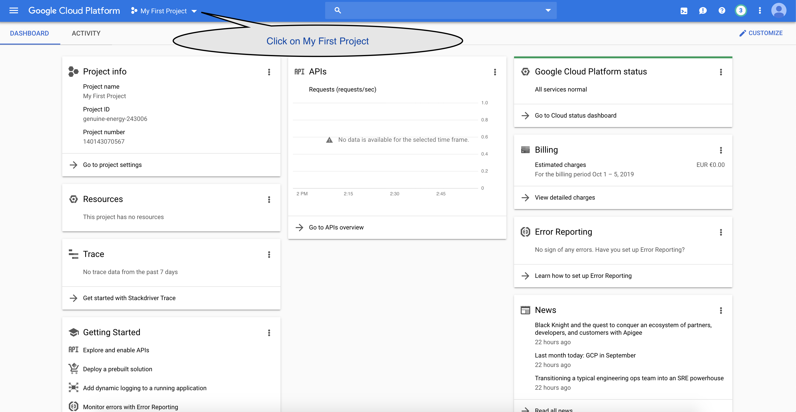
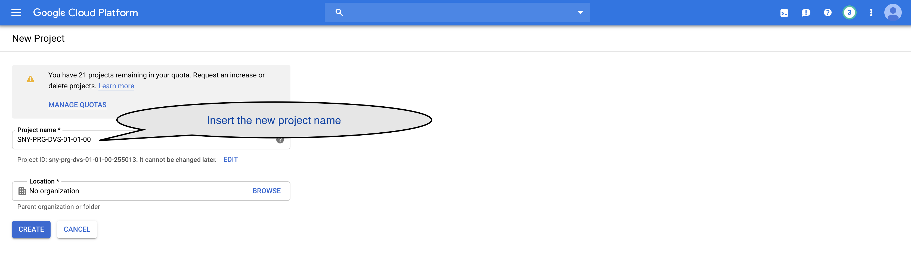
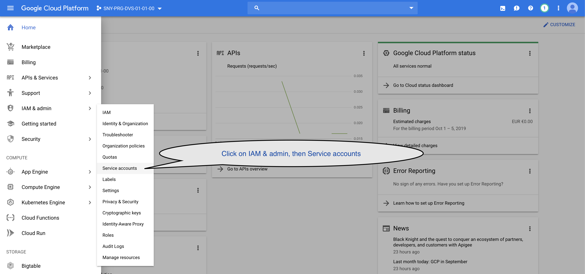
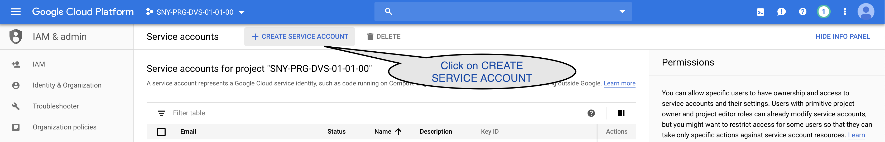
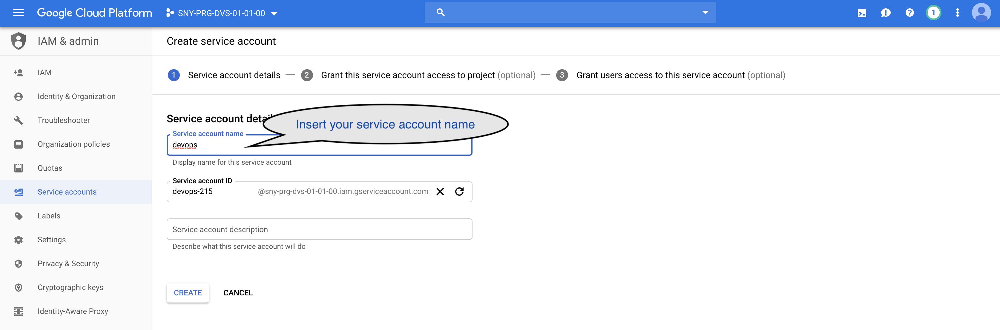
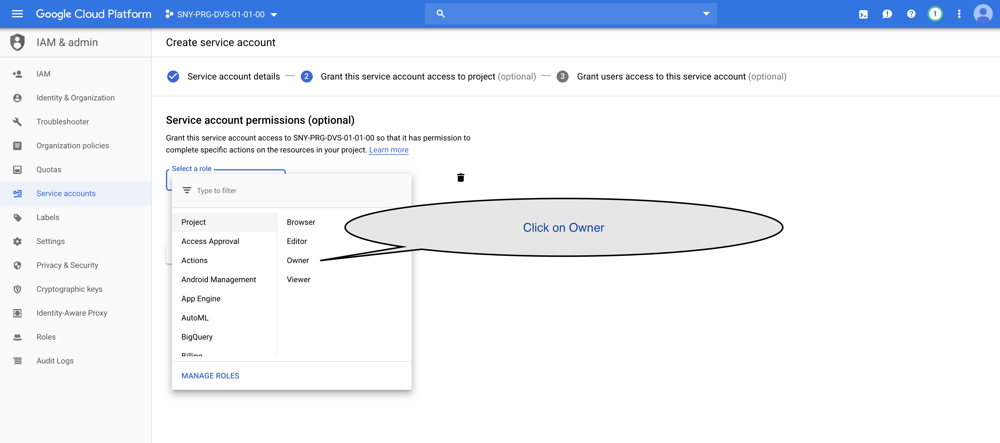
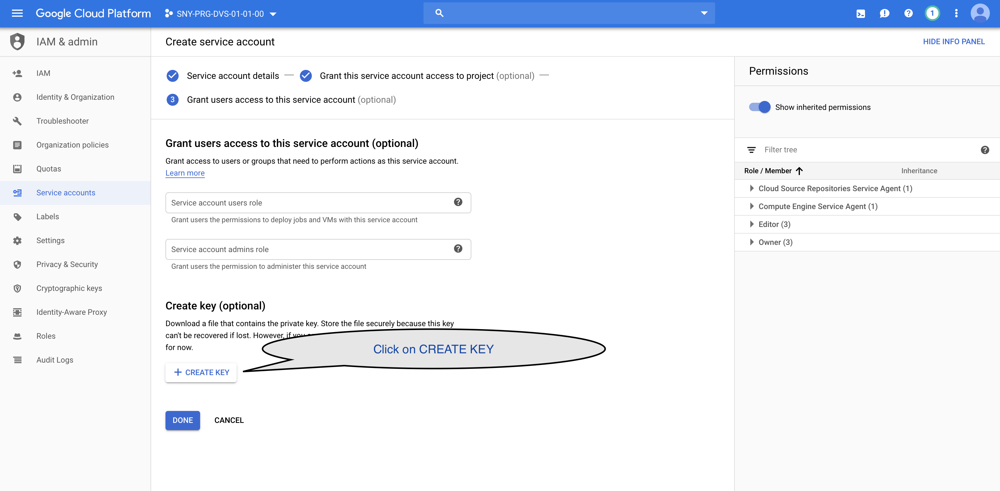

# Google Kubernetes Engine Demo

## Prerequisites

- HashiCorp Terraform v. 0.12 or greater. [Download here](https://www.terraform.io/downloads.html)   
- A valid Google Cloud Platform account (you can register for a free trial [here](https://cloud.google.com))
- gcloud CLI tool [Download Google Cloud SDK here](https://cloud.google.com/sdk/docs/) 
- kubectl CLI tool [Download here](https://kubernetes.io/docs/tasks/tools/install-kubectl/)

## GCP new project configuration

Open the GCP console [here](https://cloud.google.com) and click on **My First Project**



On the just openend modal window, click on NEW PROJECT


Insert the new project name, then click on the CREATE button



## GCP new Service Account configuration

Being sure to have selected the newly created project, click on **IAM & admin > Service accounts** in the left menu



In the **Service account** page, click on **CREATE SERVICE ACCOUNT**



In the **Create service account** page, insert your service account name (in this case **devops**), then click on **CREATE**



In the next step of the wizard, click on **Owner** to grant the rights to our service account, then click on **CONTINUE**



Before exiting the wizard, create a new Key



Select JSON format then click **CREATE**


A new private key should have been downloaded on your computer, copy it into **<GIT_REPO_HOME>/labs/Google_Kubernetes_Engine_Demo/terraform**.

## Setup GCP environment using `gcloud` tool

Run the `gcloud init` command to create a new configuration. Please choose the newly created project and authenticate to GCP by following the instructions.

```console
$ gcloud init
Welcome! This command will take you through the configuration of gcloud.

Your current configuration has been set to: [default]

You can skip diagnostics next time by using the following flag:
  gcloud init --skip-diagnostics

Network diagnostic detects and fixes local network connection issues.
Checking network connection...done.                                                                                                                                    
Reachability Check passed.
Network diagnostic passed (1/1 checks passed).

You must log in to continue. Would you like to log in (Y/n)?  Y

Go to the following link in your browser:

    https://accounts.google.com/o/oauth2/auth?code_challenge=naYo_8i7e95LKv1RHYgK1RZNnFXFZEoYPk5It0798bOdfY&prompt=select_account&code_challenge_method=S256&access_type=offline&redirect_uri=urn%3Aietf%3Awg%3Aoauth%3A2.0%3Aoob&response_type=code&client_id=32555940559.apps.googleusercontent.com&scope=https%3A%2F%2Fwww.googleapis.com%2Fauth%2Fuserinfo.email+https%3A%2F%2Fwww.googleapis.com%2Fauth%2Fcloud-platform+https%3A%2F%2Fwww.googl11eapis.com%2Fauth%2Fappengine.admin+https%3A%2F%2Fwww.googleapis.com%2Fauth%2Fcompute+https%3A%2F%2Fwww.googleapis.com%2Fauth%2Faccounts.reauth


Enter verification code: XXXXXXXXXXXXXXXXXXXXXXXXXXXXXXXXXXXXXXXXXXXXX
You are logged in as: [name.surname@gmail.com]

Pick cloud project to use:
...
 [3] sny-prg-dvs-01-01-00
...
Please enter numeric choice or text value (must exactly match list 
item):  3

Your current project has been set to: [sny-prg-dvs-01-01-00]. 

Do you want to configure a default Compute Region and Zone? (Y/n)?  n

Created a default .boto configuration file at [/home/vagrant/.boto]. See this file and
[https://cloud.google.com/storage/docs/gsutil/commands/config] for more
information about configuring Google Cloud Storage.
Your Google Cloud SDK is configured and ready to use!

* Commands that require authentication will use name.surname@gmail.com by default
* Commands will reference project `sny-prg-dvs-01-01-00` by default
Run `gcloud help config` to learn how to change individual settings

This gcloud configuration is called [default]. You can create additional configurations if you work with multiple accounts and/or projects.
Run `gcloud topic configurations` to learn more.

Some things to try next:

* Run `gcloud --help` to see the Cloud Platform services you can interact with. And run `gcloud help COMMAND` to get help on any gcloud command.
* Run `gcloud topic --help` to learn about advanced features of the SDK like arg files and output formatting
```

## Enable some GCloud services

Run the following commands on your terminal so as to enable some GCP APIs services

```console
$ gcloud services enable compute.googleapis.com
$ gcloud services enable servicenetworking.googleapis.com
$ gcloud services enable cloudresourcemanager.googleapis.com
$ gcloud services enable container.googleapis.com
```

## Google Kubernetes Engine cluster provisioning

Move to the lab folder
```console
$ cd <GIT_REPO_HOME>/labs/Google_Kubernetes_Engine_Demo/terraform
```


Create your variable file by copying as showed here after

```console
$ cp terraform.tfvars terraform.auto.tfvars
```

In the `terraform.auto.tfvars` change the following values so as to reflect your GCP account/configuration:

```terraform
credentials    = "sny-prg-dvs-01-01-00-d6ee8c94b0e7.json"
project_id         = "sny-prg-dvs-01-01-00"
service_account    = "devops@sny-prg-dvs-01-01-00.iam.gserviceaccount.com"
```

Other variables can be left as they are.

Init the terraform environment
```console
$ terraform init
...
```

Then, apply your configurations

```console
$ terraform apply
...
Do you want to perform these actions?
  Terraform will perform the actions described above.
  Only 'yes' will be accepted to approve.

  Enter a value: yes
... 
Apply complete! Resources: 3 added, 0 changed, 0 destroyed.
```

After a bunch of outputs, a green message like `Apply complete! Resources: 3 added, 0 changed, 0 destroyed.` notifies you that everything went fine and your GKE cluster has been provisioned.


## Get the cluster's kubeconfig file

Next, grap the **kubeconfig** file, needed by kubectl to access to the cluster.

```terraform
$ gcloud beta container clusters get-credentials demo-gke-cluster --region europe-west4 --project sny-prg-dvs-01-01-00
```

**BE AWARE:** change project id 'sny-prg-dvs-01-01-00' with your

Test your cluster:

```console
$ kubectl cluster-info 
Kubernetes master is running at https://34.90.111.216
calico-typha is running at https://34.90.111.216/api/v1/namespaces/kube-system/services/calico-typha:calico-typha/proxy
GLBCDefaultBackend is running at https://34.90.111.216/api/v1/namespaces/kube-system/services/default-http-backend:http/proxy
Heapster is running at https://34.90.111.216/api/v1/namespaces/kube-system/services/heapster/proxy
KubeDNS is running at https://34.90.111.216/api/v1/namespaces/kube-system/services/kube-dns:dns/proxy
kubernetes-dashboard is running at https://34.90.111.216/api/v1/namespaces/kube-system/services/https:kubernetes-dashboard:/proxy
Metrics-server is running at https://34.90.111.216/api/v1/namespaces/kube-system/services/https:metrics-server:/proxy
```

And/or

```console
$ kubectl get nodes
NAME                                                  STATUS   ROLES    AGE   VERSION
gke-demo-gke-cluster-default-node-poo-73396ce1-ktp8   Ready    <none>   20m   v1.14.8-gke.12
gke-demo-gke-cluster-default-node-poo-73396ce1-wn6w   Ready    <none>   20m   v1.14.8-gke.12
gke-demo-gke-cluster-default-node-poo-8634657d-4r35   Ready    <none>   20m   v1.14.8-gke.12
gke-demo-gke-cluster-default-node-poo-95a3edf1-k1zp   Ready    <none>   20m   v1.14.8-gke.12
gke-demo-gke-cluster-default-node-poo-95a3edf1-tp4r   Ready    <none>   20m   v1.14.8-gke.12
```

## Application deployment

We will install on K8S a cloud native application with this architecture


Create a dedicated K8S namespace

```console
$ kubectl create namespace vote
namespace/vote created
```

Move to the **app** folder

```console
$ cd <GIT_REPO_HOME>/labs/Google_Kubernetes_Engine_Demo/app
```

Apply all the resources declared in the **app.yml** file

```console
$ kubectl apply -f .
deployment.apps/db created
service/db created
deployment.apps/redis created
service/redis created
deployment.apps/result created
service/result created
deployment.apps/vote created
service/vote created
deployment.apps/worker created
...
```

You should see some messages saying that resources have been created successfully

To access the application, you will use the public IP address of the **voting-service** Service. To get it, type the following command:

```console
$ kubectl get services
NAME             TYPE           CLUSTER-IP     EXTERNAL-IP      PORT(S)        AGE
db               ClusterIP      10.89.10.162   <none>           5432/TCP       16m
kubernetes       ClusterIP      10.89.0.1      <none>           443/TCP        64m
redis            ClusterIP      10.89.15.78    <none>           6379/TCP       16m
result-service   LoadBalancer   10.89.4.191    34.90.157.102    80:32064/TCP   16m
voting-service   LoadBalancer   10.89.4.19     35.204.214.174   80:32599/TCP   16m
```

In this example, you will point your browser to http://35.204.214.174.

